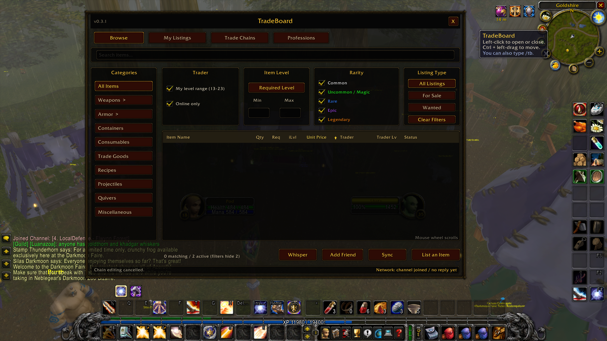
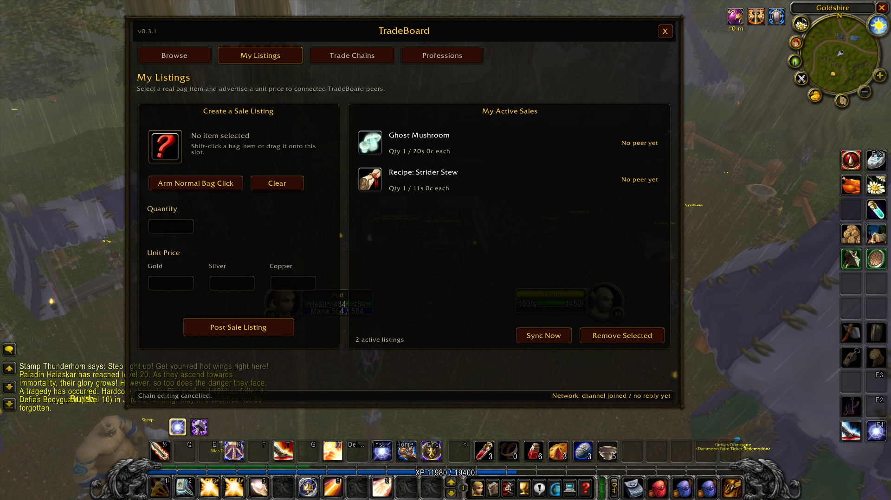
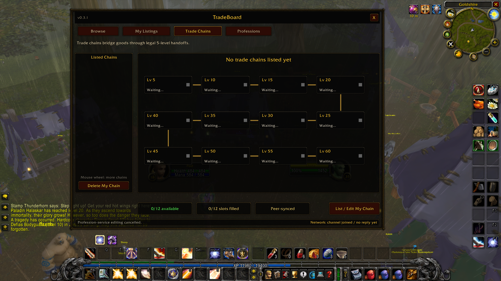
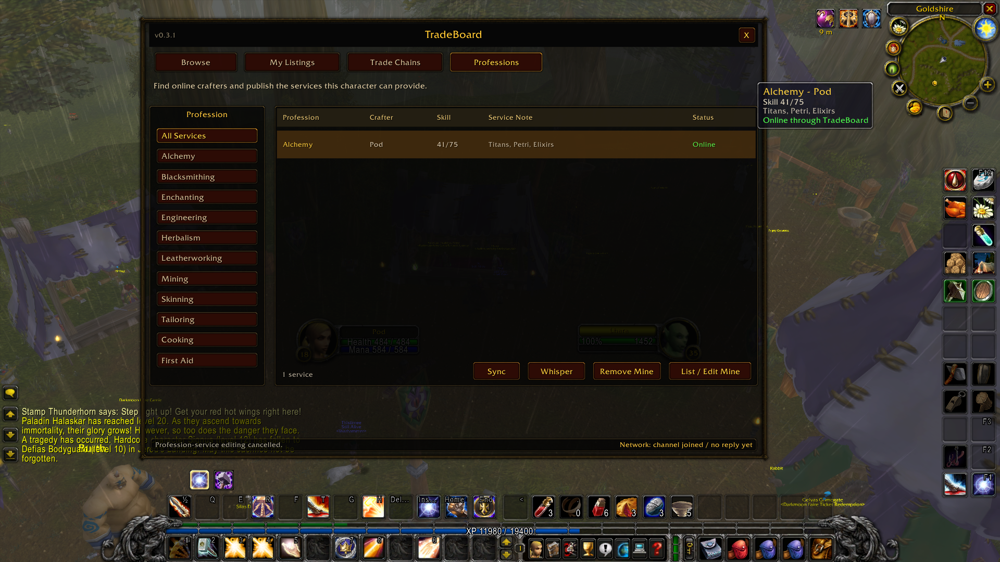

# HC TradeBoard 0.7.0

HC TradeBoard is a lightweight peer-synced market board for World of Warcraft 1.12.1. It has no central server: online clients exchange active listings and trade chains through a hidden custom chat channel named `TradeBoard`.

## Screenshots

| Browse and filter listings | Create and manage sale listings |
| --- | --- |
|  |  |

| Build community trade chains | Find profession providers |
| --- | --- |
|  |  |

## Install

1. Copy the `HC-Tradeboard` folder into `World of Warcraft\Interface\AddOns\`.
2. Confirm the final path is `Interface\AddOns\HC-Tradeboard\HC-Tradeboard.toc`.
3. Start the 1.12.1 client and enable **HC TradeBoard** on the character-selection AddOns screen.
4. Log in. HC TradeBoard stays closed until you open it.

Use `/tb`, `/tradeboard`, or left-click the coin icon beside the minimap to hide or show it. Hold Ctrl and left-drag the coin to move it around the minimap.

Press **Esc** or the enlarged **X** button to close TradeBoard immediately, including during combat. Esc also closes the full window when one of TradeBoard's text fields has keyboard focus.

## Using it

- Open HC TradeBoard with `/tb`, `/tradeboard`, or the minimap coin.
- Opening HC TradeBoard requests current peer data and refreshes at most every ten minutes while the window remains open. `/tb probe` and `/tb sync` remain available as diagnostic commands, with a short anti-spam cooldown.
- With HC TradeBoard open, Shift-left-click a bag item to load it into **My Listings**. You can also drag it onto the sale slot or arm one normal bag click. HC TradeBoard never opens the bags automatically.
- A character can publish any number of active sale listings using quantity and a total stack price. Scroll **My Active Listings**, then select one and click **Remove Selected** to withdraw it.
- In **Trade Chains**, use **List / Edit My Chain** to publish your chain or **Delete My Chain** to withdraw it.
- In **Professions**, use **List / Edit Mine** to publish services learned by the current character, including skill rank and an optional short note.
- The Professions tab includes the three guilds with the most distinct providers. Click a guild sigil to filter the service table; click it again to clear the filter.
- Press Enter to open normal chat, then Shift-left-click a listed item to insert its real item link.
- Guild item offers automatically open a compact loot window. Click an item to inspect it, or **Whisper** to draft a reply. `/tb guildloot off` disables notifications; `/tb guildloot on` enables them again.

## Features

- Browse, My Listings, Trade Chains, Professions, and World Trade tabs.
- A searchable World and Trade-channel archive retaining up to twelve hours and the newest 500 case-insensitive WTS, WTB, and LFW posts. It is shared with peers using duplicate suppression and includes inline hoverable/clickable item links. Idea credit: Svenne :)
- No automatic `/who` calls. Sellers with unknown levels have a `?` button for a player-initiated visible Who lookup. All lookup buttons share a 30-second countdown; buttons disappear once the level is known. Matching level, class, and guild data is shared across tabs and peers.
- Guild give/sell offers with item links open a dismissible, draggable loot popup. Item-only followups from that guildmate within 60 seconds join the offer. Queues and duplicate detection are bounded, and the feature sends no additional chat or peer traffic.
- Item-linked WTS/WTB chat messages appear as expiring **Chat** offers in Browse. Recognized crafting offers such as Crusader appear as expiring, clearly labelled **Chat** services in Professions.
- A classic minimap coin button for opening and closing HC TradeBoard.
- Search, category, rarity, trader-level, online, listing-type, and item-level filters.
- Simple Armor and Weapons subcategories without the full Auction House category tree.
- One AH-style filter row with **Level**, **Rarity**, and **Listing Type** dropdowns, Min/Max fields, Online and Clear. Level defaults to **All**; **My range** explicitly enables the seller-level +/-5 filter.
- Item metadata is normalized for both stock 1.12 and extended client APIs before filtering. Previously misclassified cached items repair automatically, including Armor > Mail.
- Click any table header to sort ascending or descending, including numeric total-price sorting.
- Compact AH-style layouts and classic WoW scrollbars across Browse, My Listings, Trade Chains, Professions, and World Trade.
- Hover a Browse result to see the normal WoW item-stat tooltip stacked above the HC TradeBoard listing summary.
- Item-stat tooltips pass raw `item:...` hyperlinks for compatibility with AtlasLoot tooltip hooks.
- Real bag-backed sale listings with quantity and gold/silver/copper total pricing; per-item price is calculated only in the tooltip.
- Saved personal listings and a saved 12-slot level 5-60 trade chain.
- Lightweight peer discovery, deduplicated queues, two-second global send pacing, eight-second World-log pacing, 15-minute announcements, and persistent offline caching. Background sends pause briefly whenever the player chats, reducing the risk of server spam throttling.
- Listing broadcasts include the seller's current character level and item icon texture, with local item-cache refresh as a fallback.
- Offline listings remain available when **Online only** is unchecked, with dimmed rows and last-seen information.
- Peer-synced profession services with profession and guild filters, current skill rank, guild name, optional service notes, online/last-seen status, and direct whispering.
- Published profession rank changes are detected locally, debounced for 45 seconds, and coalesced so only professions whose rank changed are announced.
- Top-three guild provider cards count distinct characters and use a deterministic shared shield sigil derived from the guild name.
- Browse and Professions tables include Guild columns.
- The custom protocol channel is removed from the visible chat windows after joining.
- Visible network state and peer count in the HC TradeBoard status bar.
- Select a listing to open a whisper to its trader or request to add that trader to the friend list.
- The minimap-button position is saved between sessions.
- Combat-safe direct closing through Esc, the top-level X button, `/tb`, or the minimap coin.

## Current limitations

- Every player who wants to see or publish listings needs HC TradeBoard installed and must be able to join the same custom channel. Whether Horde and Alliance share that custom channel depends on the server implementation.
- Guild loot popups are shown only to guildmates running the addon and receiving the original guild chat. Offers are inferred from wording such as WTS, selling, free, or "Anyone need anything?"; unrelated item mentions are ignored.
- Stock 1.12 exposes required level but not actual item level in `GetItemInfo`; unavailable iLvl is shown as `-`. Uncached item categories become filterable when the client provides their metadata.
- The 30-second Who timer tracks lookups initiated by TradeBoard buttons; independent `/who` commands and server-specific throttles may impose an additional wait.
- Listings are an advertisement only. HC TradeBoard does not move items, money, or automate trades.
- Remote listings and profession services are cached locally and become offline after ten minutes without a refresh. They remain until an explicit withdrawal is received or the saved cache is cleared, so an undelivered withdrawal can leave an old offline advertisement visible.
- Version 0.6.0 uses the `TB2` protocol because listing prices changed from per-item to total price. Peers must update to 0.6.0 or newer to exchange data.
- Chat-offer parsing is deliberately conservative: Browse requires a real item link, profession imports require a recognized service keyword, and quantity/price extraction is best effort. Chat-derived entries are visibly labelled and expire after twelve hours.
- SavedVariables are shared by characters on one WoW account. Separate accounts share the World/Trade archive and Who-derived data only while their clients can meet through the peer channel.
- The first live build publishes sale listings. Wanted-order creation is planned but not yet in the posting form.

## Regression checks

From the parent workspace directory, run `HC-Tradeboard/tests/data_regressions.lua`, `HC-Tradeboard/tests/world_log_smoke.lua`, `HC-Tradeboard/tests/ui_smoke.lua`, and `HC-Tradeboard/tests/guild_loot_smoke.lua` with a Lua test runtime (Fengari supported). The checks cover legacy/modern item tuples, all categories, delayed item caching, ring retention after Who enrichment, shared cooldown, dropdown interactions, and guild notifications. The UI checks use mocked game frames; final game rendering still needs a 1.12 client check.
